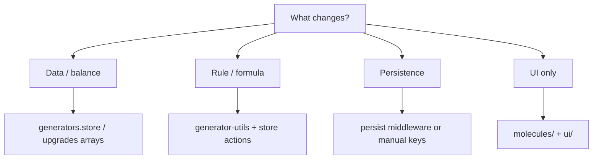

# Agent guide: building features in this repo

This guide is written for **automated agents and humans** who need to ship changes without rediscovering the codebase each time.

## Before you edit

1. Read [architecture.md](./architecture.md) and the section of [domain-model.md](./domain-model.md) that matches your task.
2. Identify whether you are changing **data**, **rules**, **persistence**, or **UI** — keep those concerns in the layers described below.
3. Run `bun run build` or `npm run build` before finishing (TypeScript + Vite build).

## Conventions (must follow)

- **Imports:** Do not reformat unrelated imports. Match existing import style; the project uses Prettier-aligned patterns — if your edit touches imports, format them per repo rules.
- **Scope:** Touch only files needed for the feature. No drive-by refactors.
- **Types:** `GeneratorId` and generator definitions must stay consistent (`generators.store.ts`). Upgrades reference `GeneratorId` in `effects`.
- **Persistence:** If you add fields, decide whether they need `localStorage` / `persist` / manual save — see [persistence.md](./persistence.md).
- **Cross-store calls:** Prefer `useXStore.getState()` inside actions or utils to avoid hooks misuse; watch for circular imports.

## File map (where to work)

| Area | Location |
|------|----------|
| App shell, tick loop, layout fork | `src/App.tsx` |
| Generator definitions & tick | `src/state/generators.store.ts` |
| Money | `src/state/money.store.ts` |
| Innovation, managers | `src/state/innovation.store.ts` |
| Upgrade catalog & unlock | `src/state/upgrades.store.ts` |
| Cost / unlock helpers | `src/utils/generator-utils.ts` |
| Purchase UX hook | `src/hooks/use-purchase-generator.ts` |
| Sidebar tabs | `src/molecules/sidebar.tsx`, `src/state/global-settings.store.ts` |
| Generator / upgrade lists | `src/molecules/generators.tsx`, `src/molecules/upgrades.tsx` |
| Reset | `src/molecules/reset-button.tsx` |
| Office canvas | `src/office/office.tsx`, `src/office/viewport.tsx`, `src/office/math-utils.ts`, `src/office/atlas/` |
| Office map data (iso tiles / stacks) | `src/office/map/tilemaps/default/*.txt`, `parse-tilemap-text.ts`, `build-office-map.ts`, `TileInstance` in `types.ts` |
| Version / wipe | `src/state/version.store.ts`, `src/hooks/use-compare-version.ts` |
| Shared UI | `src/ui/*` |

## Recipes

### Add a new generator type

1. Extend `GeneratorId` and append to `GENERATOR_TYPES` in `generators.store.ts`.
2. If gated, set `unlockConditions` referencing existing ids.
3. Add any upgrades that target the new `genId` in `upgrades.store.ts`.
4. Update UI strings if the generators list relies on `name` only (verify `generators.tsx` / `generator-buy-button.tsx`).
5. Run the app: confirm `syncUnlockedGenerators` adds the row when conditions meet.

### Add a new upgrade

1. Add an object to the appropriate array in `upgrades.store.ts` (or new array merged into `UPGRADES`).
2. Use `unlockConditions` and `effects` with valid `GeneratorId` values.
3. `syncAvailableUpgrades` is already called from generator tick and purchase paths; if you add a **new** way to change counts, call `syncAvailableUpgrades()` after that change.

### Change production or tick timing

1. **Generator tick cadence:** `tickGenerators` uses `globalLastTick` and a **1000 ms** threshold — changing economy speed may require adjusting that gate, not only `interval` on generators.
2. **Loop frequency:** `App.tsx` uses `16` ms `setInterval` — this only polls; internal gates still control real tick periods.
3. **Manager tick:** `MANGER_TICK_INTERVAL` in `innovation.store.ts` (200 ms).

### Add a persisted player preference

- Simple key-value: Zustand `persist` middleware (see `theme.store.ts` or `global-settings.store.ts`).
- Large nested state with `Decimal`: follow `innovation.store.ts` + `_break_infinity.decimals.ts`.

### Wire the office to game state

Currently **no** subscription. Typical approach:

- Pass minimal props from `App.tsx` into `Office`, or
- Call `useGeneratorStore` / selectors inside `World` (be careful: Pixi components still obey React render rules).

Avoid doing heavy object allocation every frame inside `useTick`; prefer ref-based updates for high-frequency visual sync if needed.

### Bump game version

1. Update `CURRENT_VERSION` in `version.store.ts`.
2. Understand [persistence.md](./persistence.md) — minor/major bumps clear saves.

## Verification checklist

- [ ] Typecheck passes (`pnpm exec tsc -b` or `bun run build`)
- [ ] New generator ids appear in `GeneratorId` and any upgrade `effects`
- [ ] `localStorage` implications documented or handled
- [ ] Mobile layout still usable if the feature is player-facing
- [ ] No new circular imports between stores

## Diagram: decision flow for a feature

## Related docs

- [README.md](./README.md) — index of all docs
