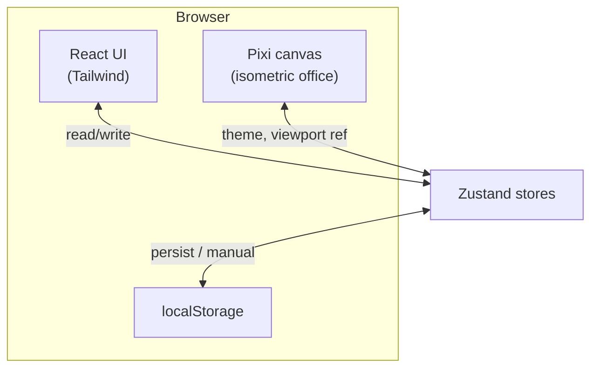
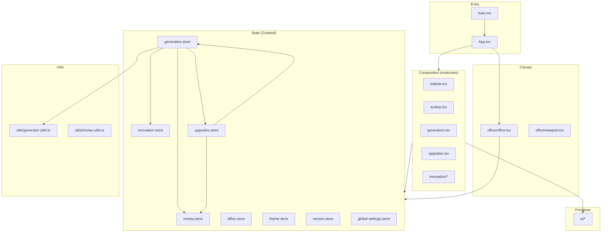
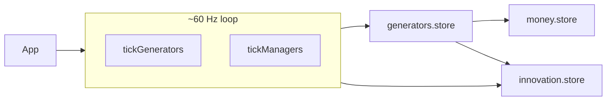
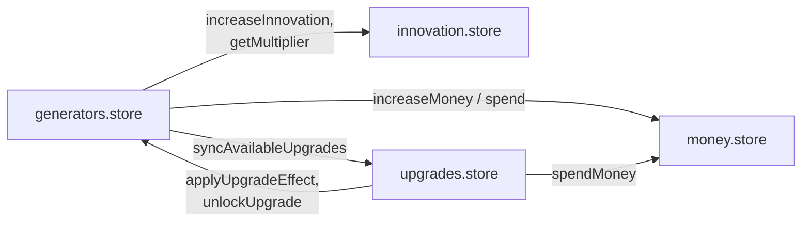
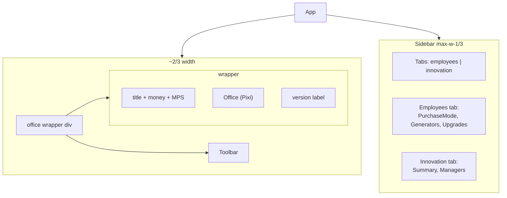

# Architecture overview

## System context

The game is a client-only SPA. There is no backend API. All progression is simulated in the browser and persisted in `localStorage`.

## Layered structure

**Guidance for agents**

- Put **domain rules** (costs, unlock logic, tick math) in `src/state/*.store.ts` or `src/utils/*` — not inside presentational components.
- Put **wiring and layout** in `App.tsx` and `src/molecules/*`.
- Put **reusable controls** in `src/ui/*` (buttons, dialogs, tabs).

## Application shell (`App.tsx`)

Important behaviors owned by `App.tsx`:

- **Game loop:** `setInterval(..., 16)` calls `tickGenerators` and `tickManagers` (see [domain-model.md](./domain-model.md) for tick cadence details).
- **Theme:** syncs `useThemeStore` to `document.documentElement.classList` (`dark`).
- **Document title:** periodic update from `useMoneyStore`.
- **Layout fork:** `window.innerWidth <= 768` renders a simplified mobile column; otherwise desktop split (office + sidebar).
- **Office sizing:** `useResizeToWrapper` + `wrapperRef` gates rendering of `<Office />` until dimensions exist.

## Store dependency graph (cross-store calls)

Stores are **not** a strict DAG: generators, money, innovation, and upgrades reference each other at runtime via `getState()`.

When adding a new store or action, trace **who calls whom** to avoid circular import issues. Prefer importing **types** from a small shared module if two stores need mutual awareness.

## UI composition (desktop)

## UI composition (mobile)

Mobile omits `Toolbar`, `Sidebar`, and `Office`. It still runs the same tick loop and stores; only the view is reduced (tap money, generators, upgrades, settings).

## Related docs

- [domain-model.md](./domain-model.md) — tick intervals and economic formulas
- [persistence.md](./persistence.md) — what survives reloads and version bumps
- [agent-guide.md](./agent-guide.md) — where to edit for typical tasks
