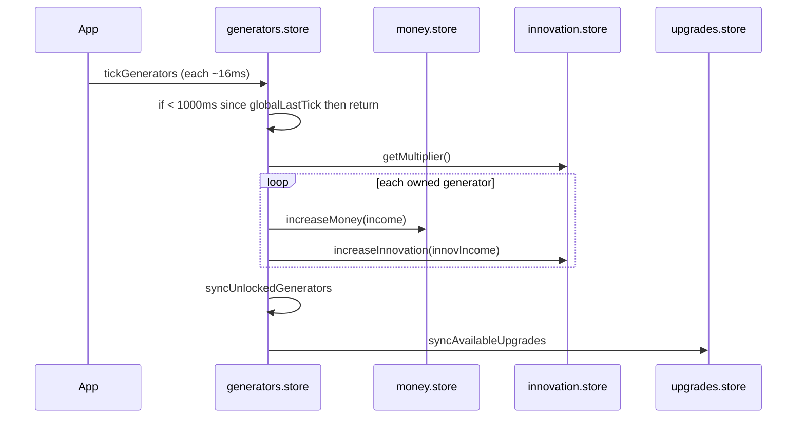
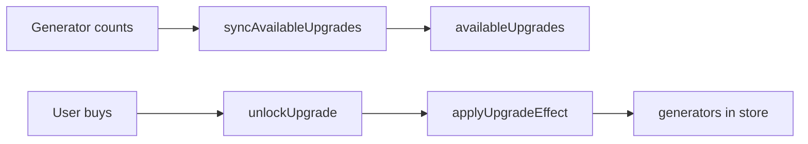

# Domain model and game mechanics

This document is the **source of truth for game logic** as implemented in code. When balancing or adding content, start here and then open the cited files.

## Currencies

| Currency | Store | Role |
|----------|--------|------|
| Money | `money.store.ts` | Primary spend for generators and upgrades; passive income from generators |
| Innovation | `innovation.store.ts` | Secondary resource; unlocks innovation UI features; spent on managers |

Money uses `break_infinity.js` `Decimal` with manual `localStorage` sync on change. Innovation uses Zustand `persist` with custom JSON replacer/reviver for `Decimal` (`_break_infinity.decimals.ts`).

## Generators

**Definition table:** `GENERATOR_TYPES` in `generators.store.ts`.

Each generator has:

- `baseProduction`, `interval` (ms), `cost`, `costExponent`
- `innovationProduction` (small per-tick contribution to innovation)
- Optional `unlockConditions` (requires N of another generator type)

**Owned state** (`OwnedGenerator`): `amount`, `lastTick`, `multiplier`, `costMultiplier`, `costExponent` (can diverge from base via upgrades), `innovationMultiplier`.

### Unlocking generator types

`getUnlockedGeneratorIds` in `generator-utils.ts` walks `GENERATOR_TYPES` and includes a type if it has no conditions or all conditions are satisfied by **current owned amounts**. `syncUnlockedGenerators` in `generators.store.ts` appends newly eligible types to state after ticks and purchases.

### Purchase cost

`getGeneratorCost(id, amount)` in `generator-utils.ts` implements a geometric-series style total for buying `amount` additional units, using current `cost`, `costExponent`, `costMultiplier`, and `amount`.

`useGeneratorPurchase` (`use-purchase-generator.ts`) resolves single vs max purchase using `purchaseMode` and `getMaxAffordableAmountAndCost`.

### Production tick — `tickGenerators`

- **Global gate:** runs meaningful work when `now - globalLastTick >= 1000` (1 second), then updates `globalLastTick`.
- **Per generator with `amount > 0`:**  
  `ticks = floor(globalTickInterval / gen.interval)` (typically 1 when intervals are 1000 ms).
- **Money income (per gen):**  
  `baseProduction * innovationMultiplier * amount * multiplier * ticks`  
  where `innovationMultiplier` is `useInnovationStore.getState().getMultiplier()` (function of total innovation).
- **Innovation income (per gen):**  
  `innovationProduction * amount * innovationMultiplier * ticks`
- After applying income, persists generators, calls `syncUnlockedGenerators()` and `syncAvailableUpgrades()`.

### Display rate — `getMoneyPerSecond` / `getInnovationPerSecond`

These aggregate per-generator contributions using the same factors as ticks, normalized by `(interval / 1000)` to express “per second”.

## Upgrades

**Catalog:** `UPGRADES` in `upgrades.store.ts` (grouped as `INTERN_UPGRADES`, `VIBE_CODER_UPGRADES`, `TEN_X_ENGINEER_UPGRADES`).

Each upgrade has:

- `unlockConditions` (generator counts)
- `cost` (plain number; compared with `money.toNumber()` on unlock)
- `effects`: list of `{ genId, changes[] }` where `changes` are `multiplier`, `costMultiplier`, or `costExponent` deltas

`syncAvailableUpgrades` builds `availableUpgrades`: conditions met, not already in `unlockedUpgrades`, sorted by `cost`.

`unlockUpgrade(id)` spends money, runs `applyUpgradeEffect` (mutates matching generators’ multipliers / cost fields), persists upgrade IDs in `localStorage`, refreshes available list.

## Innovation layer

### Global multiplier

`getMultiplier(): log10(innovation + 1) + 1` — scales **money** production from generators (see tick formula).

### Unlocks

`unlocks` record (e.g. `managers`, `employeeManagement`) with `cost` in innovation; `unlock` spends innovation and sets `unlocked: true`.

### Managers (`agile`, `corpo`, `sales`)

Each manager track has assignment count, progress toward tier, tier, growth parameters, and a **bonus multiplier** that scales with tier.

- **Tick:** `tickManagers` runs when `now - globalLastTick >= 200` ms (`MANGER_TICK_INTERVAL`), then updates `globalLastTick` on the innovation store.
- **Progress gain:** assignment × growthRate × ticks / tierModifier; at threshold (100), tier increments and progress wraps.
- **Bonus:** `bonusMultiplier = bonusMultiplierGrowthPerTier ^ tier`

Assign / unassign uses geometric cost sums with base cost 1 and growth 1.5 (`getManagerCost`, `getManagerRefund`, `assignManager`, `unassignManager`).

## Manual money click

Both layouts: clicking the money display calls `increaseMoney(max(mps/10, 1))` where `mps` is `getMoneyPerSecond()`.

## Extension points (content and systems)

| Goal | Primary touch points |
|------|----------------------|
| New generator type | `GENERATOR_TYPES`, `GeneratorId` type, sprites/UI labels if needed |
| New upgrade | `UPGRADES` entry; ensure `syncAvailableUpgrades` still runs after relevant state changes |
| New currency | New store + wire into tick/purchase; consider persist pattern like innovation |
| Change tick rate | `App.tsx` interval; **and** gates inside `tickGenerators` / `tickManagers` |
| New sidebar tab | `SidebarTab` in `global-settings.store.ts`, `sidebar.tsx` tabs config |

## Related docs

- [persistence.md](./persistence.md) — which fields persist
- [architecture.md](./architecture.md) — who calls ticks and when
