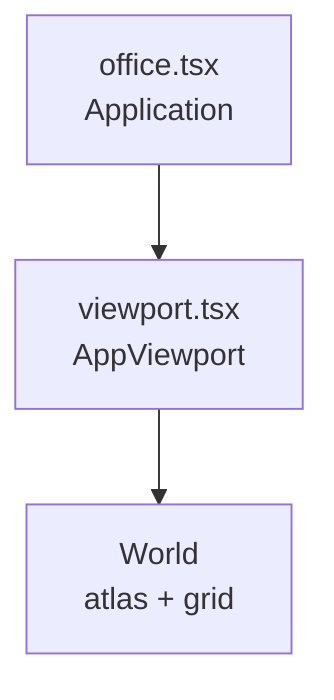

# UI and rendering

## Stack

- **DOM:** React 19, Tailwind CSS v4 (`@tailwindcss/vite`), `@fontsource/space-mono`
- **Floating UI:** `@floating-ui/react` — `FloatingTree` wraps the app for popovers/tooltips
- **Toasts:** `react-hot-toast` with custom `Toast` component
- **Headless components:** `@headlessui/react` (e.g. dialogs)
- **Canvas:** `@pixi/react` + Pixi 8 + `pixi-viewport`

## Design tokens

`src/index.css` defines `@theme` CSS variables:

- Font: `--font-space-mono`
- Palette: `--color-primary-50` … `--color-primary-900`

Dark mode uses class `.dark` on `document.documentElement` (driven by `theme.store` + `App.tsx`).

Utility classes `responsive-header`, `responsive-text`, etc., scale typography at large breakpoints (`3xl`, `4xl` custom variants).

## Desktop layout

- **Left:** `Toolbar`, then a full-size wrapper containing HUD (title, money, MPS), **Pixi `Office`**, version text.
- **Right:** `Sidebar` with tabs **Employees** | **Innovation**.

`Office` receives `wrapperRef` and measured `wrapperSize` from `useResizeToWrapper` so the Pixi application matches the div.

## Mobile layout (`<= 768px`)

No `Toolbar`, no `Sidebar`, no `Office`. Column layout with money, optional innovation counter, purchase mode, generators, upgrades, settings.

**Agents:** any new primary feature should consider whether it appears on mobile or needs a parallel entry point.

## Pixi office (`src/office/`)

- **`Application`:** `resizeTo={wrapperRef}`, `preference="webgpu"`, high `resolution` for crisp pixels.
- **`AppViewport`:** `pixi-viewport` with drag, pinch, wheel zoom; registers instance in `office.store` for world/pointer math; `clampZoom` for scale limits; each `frame-end`, [`constrainViewportToOfficeBounds`](../src/office/utils/clamp-viewport.ts) keeps the view inside fixed world min/max (no `viewport.clamp()` plugin).
- **`World`:** loads **Starling** atlases from [`public/isometric_assets/`](../public/isometric_assets/) via [`loadIsometricAtlasTextures`](../src/office/atlas/load-isometric-atlases.ts) (`fast-xml-parser` + Pixi `Spritesheet`), renders an **isometric tile list** with depth sorting, tints the **top** tile under the pointer when a column is stacked.

Background color follows theme by reading CSS variables from `document.body` at module load (`lightBg` / `darkBg`) and applying to `app.renderer.background` when theme changes.

### Isometric tilemap (stacked layers)

| Piece | Role |
|-------|------|
| [`src/office/map/types.ts`](../src/office/map/types.ts) | `TileInstance`: `mapX`, `mapY`, `z` (elevation), `spriteId` (SubTexture name) |
| [`src/office/map/build-office-map.ts`](../src/office/map/build-office-map.ts) | `getDefaultMap` / `buildOfficeMap` — loads bundled ASCII tilemap |
| [`src/office/map/parse-tilemap-text.ts`](../src/office/map/parse-tilemap-text.ts) | `parseLayeredTilemap`, `parseLegend` |
| [`src/office/map/tilemaps/default/`](../src/office/map/tilemaps/default/) | `legend.txt`, `layer-0-ground.txt`, `layer-1.txt`, `layer-2.txt` (visual grid) |
| [`src/office/map/map-utils.ts`](../src/office/map/map-utils.ts) | `roadMapX` helper |
| [`src/office/map/index.ts`](../src/office/map/index.ts) | Re-exports for imports from `./map` |
| [`src/office/math-utils.ts`](../src/office/math-utils.ts) | `ISO_TILE_WIDTH` / `ISO_TILE_HEIGHT`, `ISO_CELL_STRIDE`, `ISO_Z_LIFT_PER_LAYER`, `mapToWorld`, `depthKey`, `viewportWorldToTilePlane`, `worldPlaneToMapCell`, `pickTopTileAtPlane` |
| [`src/office/atlas/`](../src/office/atlas/) | `parse-starling-atlas.ts`, `load-isometric-atlases.ts` — XML → Pixi textures |

**Draw order:** `depthKey(mapX, mapY, z) = mapX + mapY + z * Z_LAYER_WEIGHT` (`Z_LAYER_WEIGHT = 1000`). Larger keys draw on top (`sortableChildren` + per-sprite `zIndex`). This matches the current fixed camera; change the formula if the iso axes or view rotate.

**Pseudo-3D lift:** `mapToWorld` subtracts `z * (ISO_Z_LIFT_PER_LAYER * scale)` from the projected Y so higher layers move screen-up. Sprites use **bottom-center** anchor (`anchor.y = 1`). Flattened iso tiles are **132×99** (`ISO_TILE_WIDTH` / `ISO_TILE_HEIGHT` in [`math-utils.ts`](../src/office/math-utils.ts)); change those when the art pack size changes.

**Hover:** Pointer is converted with `viewportWorldToTilePlane` (same frame as `mapToWorld` + wrapper offsets). `pickTopTileAtPlane` resolves the column and selects the **maximum `z`**, so only the uppermost brick tints.

**New tiles:** pick a SubTexture `name` from [`public/isometric_assets/`](../public/isometric_assets/) (`*_sheet.xml`); add a `legend.txt` line `symbol name.png`; use that symbol in `layer-*.txt`. See [isometric-assets-migration.md](./isometric-assets-migration.md) for the atlas layout.

### Office scene layout (data-driven)

The default office and terrain are **drawn in text**: edit [`tilemaps/default/layer-0-ground.txt`](../src/office/map/tilemaps/default/layer-0-ground.txt) (ground), [`layer-1.txt`](../src/office/map/tilemaps/default/layer-1.txt) (raised floor / stairs), [`layer-2.txt`](../src/office/map/tilemaps/default/layer-2.txt) (walls). Symbols are defined in [`legend.txt`](../src/office/map/tilemaps/default/legend.txt). See [isometric-map-format.md](./isometric-map-format.md) for why ASCII layers vs Tiled/JSON and what Pixi projects typically use.

**Map size:** `cols` / `rows` come from the line count and line width of layer 0; [`office.tsx`](../src/office/office.tsx) uses `getDefaultMap()` so the canvas matches the file.

**Performance (optional):** `Viewport.getVisibleBounds()` from `office.store` can cull tiles outside the view. For very large maps or deep stacks, consider batched rendering ([`@pixi/tilemap`](https://www.npmjs.com/package/@pixi/tilemap) with manually placed quads) or imperative sprite pools instead of one React element per tile.

### Office vs game logic

The isometric view is **cosmetic** today: it does not read generator counts or place entities. Gameplay is entirely in Zustand + React sidebar.

**Agents:** linking office visuals to game state would be a **new integration** (subscribe stores in `World` or pass props from `App`).

## Dependency upgrades

`@pixi/react` and `pixi.js` should stay on compatible major lines (`peerDependencies` on `@pixi/react` lists supported `pixi.js` ranges). After bumping either package, run a full `build` and smoke-test the office viewport.

## Related docs

- [architecture.md](./architecture.md) — where `Office` sits in the tree
- [agent-guide.md](./agent-guide.md) — UI conventions
