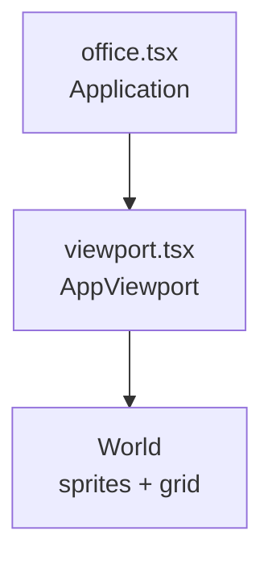

# UI and rendering

## Stack

- **DOM:** React 19, Tailwind CSS v4 (`@tailwindcss/vite`), `@fontsource/space-mono`
- **Floating UI:** `@floating-ui/react` — `FloatingTree` wraps the app for popovers/tooltips
- **Toasts:** `react-hot-toast` with custom `Toast` component
- **Headless components:** `@headlessui/react` (e.g. dialogs)
- **Canvas:** `@pixi/react` + Pixi 8 + `pixi-viewport`

## Design tokens

`src/index.css` defines `@theme` CSS variables:

- Font: `--font-space-mono`
- Palette: `--color-primary-50` … `--color-primary-900`

Dark mode uses class `.dark` on `document.documentElement` (driven by `theme.store` + `App.tsx`).

Utility classes `responsive-header`, `responsive-text`, etc., scale typography at large breakpoints (`3xl`, `4xl` custom variants).

## Desktop layout

- **Left:** `Toolbar`, then a full-size wrapper containing HUD (title, money, MPS), **Pixi `Office`**, version text.
- **Right:** `Sidebar` with tabs **Employees** | **Innovation**.

`Office` receives `wrapperRef` and measured `wrapperSize` from `useResizeToWrapper` so the Pixi application matches the div.

## Mobile layout (`<= 768px`)

No `Toolbar`, no `Sidebar`, no `Office`. Column layout with money, optional innovation counter, purchase mode, generators, upgrades, settings.

**Agents:** any new primary feature should consider whether it appears on mobile or needs a parallel entry point.

## Pixi office (`src/office/`)

- **`Application`:** `resizeTo={wrapperRef}`, `preference="webgpu"`, high `resolution` for crisp pixels.
- **`AppViewport`:** `pixi-viewport` with drag, pinch, wheel zoom; registers instance in `office.store` for world/pointer math; clamps zoom on `zoomed-end`.
- **`World`:** loads texture atlas from `sprites.ts` / `atlasData`, renders an **isometric tile list** with depth sorting, tints the **top** tile under the pointer when a column is stacked.

Background color follows theme by reading CSS variables from `document.body` at module load (`lightBg` / `darkBg`) and applying to `app.renderer.background` when theme changes.

### Isometric tilemap (stacked layers)

| Piece | Role |
|-------|------|
| [`src/office/map/types.ts`](../src/office/map/types.ts) | `TileInstance`: `mapX`, `mapY`, `z` (elevation), `terrain` |
| [`src/office/map/build-office-map.ts`](../src/office/map/build-office-map.ts) | Pure `buildOfficeMap(rows, cols)` — ground fill + demo 3-high stack at `(6,6)` |
| [`src/office/map/index.ts`](../src/office/map/index.ts) | Re-exports for imports from `./map` |
| [`src/office/math-utils.ts`](../src/office/math-utils.ts) | `mapToWorld`, `depthKey`, `viewportWorldToTilePlane`, `worldPlaneToMapCell`, `pickTopTileAtPlane` |

**Draw order:** `depthKey(mapX, mapY, z) = mapX + mapY + z * Z_LAYER_WEIGHT` (`Z_LAYER_WEIGHT = 1000`). Larger keys draw on top (`sortableChildren` + per-sprite `zIndex`). This matches the current fixed camera; change the formula if the iso axes or view rotate.

**Pseudo-3D lift:** `mapToWorld` subtracts `z * (ISO_TILE_STRIDE * scale * 0.5)` from the projected Y so higher layers move screen-up. Tune that factor when you add real cube art or bottom-anchored sprites.

**Hover:** Pointer is converted with `viewportWorldToTilePlane` (same frame as `mapToWorld` + wrapper offsets). `pickTopTileAtPlane` resolves the column and selects the **maximum `z`**, so only the uppermost brick tints.

**New terrain types:** add frames in [`src/office/sprites.ts`](../src/office/sprites.ts) and extend `TerrainKey`; reference them from `build-officeMap` or a future data file.

**Performance (optional):** `Viewport.getVisibleBounds()` from `office.store` can cull tiles outside the view. For very large maps or deep stacks, consider batched rendering ([`@pixi/tilemap`](https://www.npmjs.com/package/@pixi/tilemap) with manually placed quads) or imperative sprite pools instead of one React element per tile.

### Office vs game logic

The isometric view is **cosmetic** today: it does not read generator counts or place entities. Gameplay is entirely in Zustand + React sidebar.

**Agents:** linking office visuals to game state would be a **new integration** (subscribe stores in `World` or pass props from `App`).

## Dependency upgrades

`@pixi/react` and `pixi.js` should stay on compatible major lines (`peerDependencies` on `@pixi/react` lists supported `pixi.js` ranges). After bumping either package, run a full `build` and smoke-test the office viewport.

## Related docs

- [architecture.md](./architecture.md) — where `Office` sits in the tree
- [agent-guide.md](./agent-guide.md) — UI conventions
