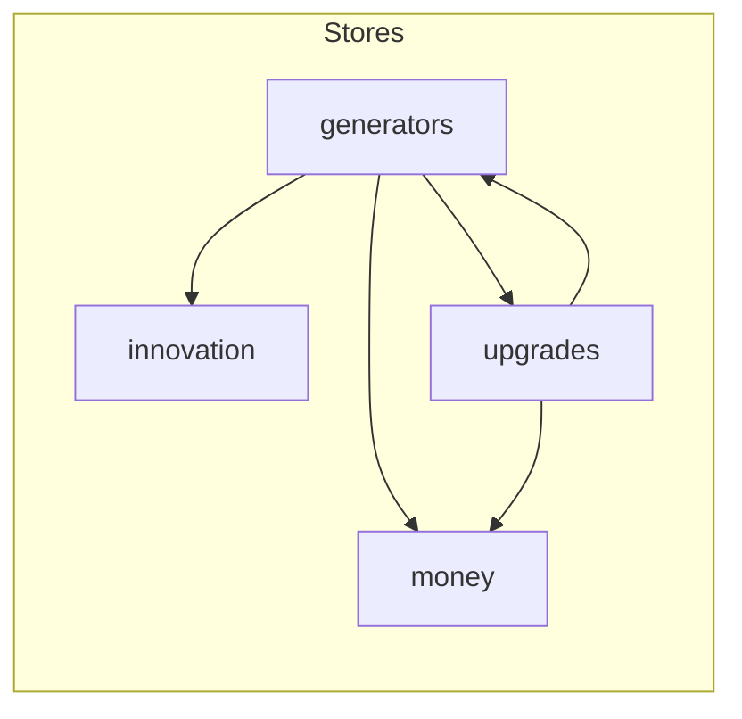

# Zustand stores — quick reference

Abbreviated surface area for navigation. See source files for full types.

## `useMoneyStore` (`money.store.ts`)

| Field / action | Role |
|----------------|------|
| `money` | `Decimal` balance |
| `increaseMoney` / `spendMoney` | Mutates balance; zustand `persist` syncs key `money` |
| `reset` | Zero balance + `persist.clearStorage()` |

## `useGeneratorStore` (`generators.store.ts`)

| Field / action | Role |
|----------------|------|
| `generators` | `OwnedGenerator[]` (only unlocked types) |
| `globalLastTick` | Last wall-clock tick boundary (ms) |
| `purchaseMode` | `"single"` \| `"max"` |
| `tickGenerators` | ~1s gated; pays money + innovation; zustand persist; sync unlocks + upgrades |
| `purchaseGenerator` | Cost check, spend, `increaseGenerator`, sync |
| `getMoneyPerSecond` / `getInnovationPerSecond` | Aggregates for HUD |
| `setPurchaseMode` | UI toggle |
| `reset` | Default generators + employee management; `persist.clearStorage()`; removes legacy `employeeManagement` key if present |

## `useInnovationStore` (`innovation.store.ts`)

| Field / action | Role |
|----------------|------|
| `innovation` | `Decimal` |
| `getMultiplier` | Scales generator **money** output |
| `increaseInnovation` / `spendInnovation` | Mutate balance (persisted) |
| `unlocks` | Feature gates purchased with innovation |
| `canUnlock` / `unlock` | Unlock flow |
| `managers` | Per-track state (`agile`, `corpo`, `sales`) |
| `assignment` | Batch size for assign / unassign |
| `assignManager` / `unassignManager` | Spend / refund innovation |
| `tickManagers` | 200 ms gated; progress + tier + bonus |
| `reset` | In-memory defaults (persist rehydration may override until cleared) |

**Note:** `reset` on innovation store does not remove the persisted `localStorage` key by itself; full game reset from UI chains multiple store resets — compare with `ResetButton` behavior.

## `useUpgradeStore` (`upgrades.store.ts`)

| Field / action | Role |
|----------------|------|
| `availableUpgrades` | Derived list (sync function) |
| `unlockedUpgradeIds` | Persisted id list |
| `unlockedUpgrades` | Catalog rows for those ids (derived on hydrate / unlock) |
| `unlockUpgrade` | Pay money, `applyUpgradeEffect`; zustand `persist` saves `unlockedUpgradeIds` |
| `reset` | Clears unlocks + `persist.clearStorage()` |

Module-level exports: `UPGRADES`, `syncAvailableUpgrades`, `applyUpgradeEffect`.

## `useOfficeStore` (`office.store.ts`)

| Field / action | Role |
|----------------|------|
| `viewport` | `pixi-viewport` instance or null |
| `setViewport` | Registered from `viewport.tsx` |

## `useThemeStore` (`theme.store.ts`)

| Field / action | Role |
|----------------|------|
| `theme` | `"light"` \| `"dark"` |
| `toggleTheme` / `setTheme` | Persisted as `theme` |

## `useGlobalSettingsStore` (`global-settings.store.ts`)

| Field / action | Role |
|----------------|------|
| `sidebarTab` | `"employees"` \| `"innovation"` |
| `setSidebarTab` | Persisted as `global-settings` |

## `useVersionStore` (`version.store.ts`)

| Field / action | Role |
|----------------|------|
| `version` | Last stored semver string |
| `setVersion` | Updated after migration check |
| `CURRENT_VERSION` | Ship version constant |
| `clearAllStorageExceptVersion` | Wipe saves on major/minor change |

---

See [persistence.md](./persistence.md) for keys and [domain-model.md](./domain-model.md) for formulas.
